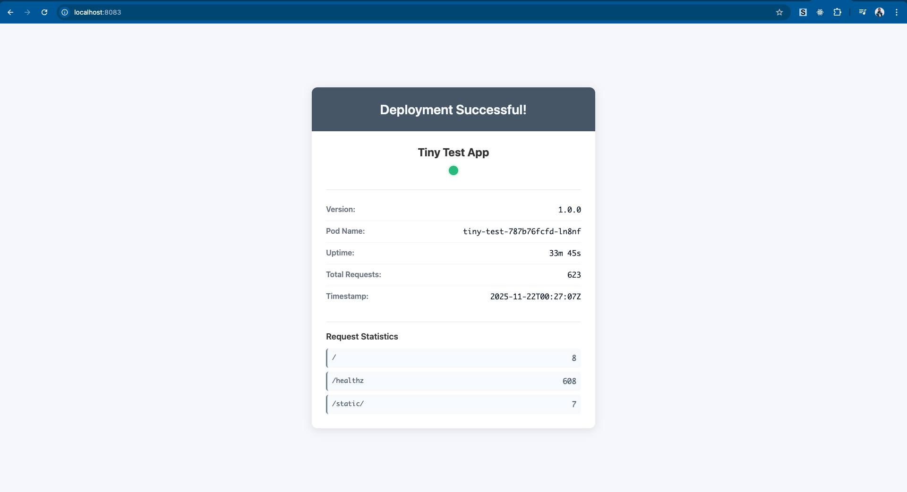

# Tiny Test App

[](https://github.com/bansikah22/tiny-test/actions/workflows/ci.yml)
[](https://opensource.org/licenses/MIT)
[](https://hub.docker.com/r/bansikah/tiny-test)

A minimal Golang web application designed for testing Kubernetes deployments. The application provides a lightweight container image (~2.13 MB) with a simple web UI and health check endpoints, optimized with UPX compression.

## Quick Start

Deploy to your Kubernetes cluster in seconds:

```bash
kubectl apply -f k8s/
kubectl port-forward service/tiny-test 8080:80
```

Open `http://localhost:8080` in your browser. The image is automatically pulled from Docker Hub.



## Features

- Ultra-lightweight container image (~2.13 MB)
- Simple web UI with deployment status, pod name, version, uptime, and request statistics
- Health check endpoint at `/healthz`
- Version endpoint at `/version`
- Info endpoint at `/info` with comprehensive JSON response including metrics
- Metrics endpoint at `/metrics` with Prometheus-style format
- Built-in request tracking and statistics per endpoint
- Uptime tracking and display
- Kubernetes-ready with deployment and service manifests

## Deployment

### Prerequisites

- Kubernetes cluster (any cluster: EKS, AKS, GKE, Minikube, kind, k3s, etc.)
- `kubectl` configured and connected to your cluster
- (Optional) Helm 3+ for Helm-based deployments

The application uses a pre-built image from Docker Hub (`bansikah/tiny-test:latest`) - no local build required.

### Option 1: Helm (Recommended)

Helm provides easier configuration management and upgrades.

```bash
# Install to the default namespace
helm upgrade --install tiny-test ./helm/tiny-test

# Or install to a specific namespace
helm upgrade --install tiny-test ./helm/tiny-test \
  --namespace tiny-test \
  --create-namespace

# Customize deployment
helm upgrade --install tiny-test ./helm/tiny-test \
  --set image.tag=v1.0.0 \
  --set replicaCount=3 \
  --set service.type=LoadBalancer \
  --set resources.requests.memory=32Mi
```

**Available Configuration Options:**

| Parameter | Description | Default |
|-----------|-------------|---------|
| `image.registry` | Docker registry | `docker.io` |
| `image.repository` | Image repository | `bansikah/tiny-test` |
| `image.tag` | Image tag | `latest` |
| `replicaCount` | Number of replicas | `1` |
| `service.type` | Service type (ClusterIP, NodePort, LoadBalancer) | `ClusterIP` |
| `service.port` | Service port | `80` |
| `resources.requests.cpu` | CPU request | `10m` |
| `resources.requests.memory` | Memory request | `16Mi` |
| `resources.limits.cpu` | CPU limit | `50m` |
| `resources.limits.memory` | Memory limit | `32Mi` |
| `ingress.enabled` | Enable ingress | `false` |

**Verify Deployment:**

```bash
kubectl get all -l app.kubernetes.io/name=tiny-test
```

**Uninstall:**

```bash
helm uninstall tiny-test
# If installed to a specific namespace
helm uninstall tiny-test -n tiny-test
```

### Option 2: Kubernetes Manifests

Direct deployment using raw Kubernetes YAML files.

```bash
kubectl apply -f k8s/
```

This will create:
- A Deployment with 1 replica
- A ClusterIP Service exposing port 80

**Verify Deployment:**

```bash
kubectl get deployment tiny-test
kubectl get pods -l app=tiny-test
kubectl get service tiny-test
```

### Access the Application

#### Port Forward (Recommended for Testing)

```bash
kubectl port-forward service/tiny-test 8080:80
```

Then open `http://localhost:8080` in your browser.

#### LoadBalancer (Cloud Providers)

For cloud environments (EKS, AKS, GKE), use a LoadBalancer:

**With Helm:**
```bash
helm upgrade --install tiny-test ./helm/tiny-test \
  --set service.type=LoadBalancer
```

**With manifests:**
Modify `k8s/service.yaml`:
```yaml
spec:
  type: LoadBalancer
```

Then apply and get the external IP:
```bash
kubectl apply -f k8s/service.yaml
kubectl get service tiny-test -w
```

#### NodePort

For local clusters (Minikube, kind, k3s) or when LoadBalancer is unavailable:

**With Helm:**
```bash
helm upgrade --install tiny-test ./helm/tiny-test \
  --set service.type=NodePort
```

**With manifests:**
Modify `k8s/service.yaml`:

```yaml
spec:
  type: NodePort
```

Then apply:

```bash
kubectl apply -f k8s/service.yaml
kubectl get service tiny-test
```

Access via:
- **Minikube**: `minikube service tiny-test --url`
- **Other clusters**: `http://<node-ip>:<node-port>`

#### Ingress


#### Gateway API (Recommended for Production)

The Gateway API is the modern standard for traffic routing in Kubernetes, replacing legacy Ingress.

**Important**: Gateway API requires a controller installation (Envoy Gateway, Istio, or cloud provider implementations). For local minikube/kind testing, use port-forward or NodePort instead. See the full production guide below.

**For Production Deployment:**

See [Gateway API Production Setup Guide](docs/GATEWAY_API_PRODUCTION.md) for complete instructions including:
- Supported implementations (AWS, Azure, GCP, Envoy Gateway, Istio)
- Step-by-step installation
- Platform-specific examples
- DNS configuration
- Troubleshooting

**Quick Example (requires Gateway API controller):**

```bash
# Apply Gateway and HTTPRoute
kubectl apply -f k8s/gateway.yaml
kubectl apply -f k8s/httproute.yaml

# Check status
kubectl get gateway tiny-test-gateway
kubectl get httproute tiny-test-route
```

**With Helm:**
```bash
helm upgrade --install tiny-test ./helm/tiny-test \
  --set ingress.enabled=true \
  --set ingress.className=gateway-api \
  --set "ingress.hosts[0].host=tiny-test.example.com" \
  --set "ingress.hosts[0].paths[0].path=/" \
  --set "ingress.hosts[0].paths[0].pathType=PathPrefix"
```

**Local Testing on Minikube/kind:**

Gateway API requires additional controller setup on local clusters. For simpler local testing, use port-forward:

```bash
kubectl port-forward service/tiny-test 8080:80
# Access at http://localhost:8080
```

### Monitoring & Troubleshooting

**View Logs:**
```bash
kubectl logs -l app=tiny-test
# Or for Helm deployments
kubectl logs -l app.kubernetes.io/name=tiny-test
```

**Check Pod Status:**
```bash
kubectl get pods -l app=tiny-test
kubectl describe pod -l app=tiny-test
```

**Test Health Endpoint:**
```bash
kubectl port-forward service/tiny-test 8080:80
curl http://localhost:8080/healthz
curl http://localhost:8080/info
curl http://localhost:8080/metrics
```

### Image Details

- **Docker Hub**: `bansikah/tiny-test:latest`
- **Image Size**: ~2.13 MB (minimal for fast deployment testing)
- **Container Port**: 8080
- **Service Port**: 80 (in Kubernetes deployments)
- **Purpose**: Lightweight test image for validating Kubernetes deployments on any cluster

## Endpoints

- `GET /` - Web UI showing deployment information, uptime, and request statistics
- `GET /healthz` - Health check endpoint (returns "ok")
- `GET /version` - Returns JSON with version information
- `GET /info` - Returns JSON with pod information including uptime and request metrics
- `GET /metrics` - Returns Prometheus-style metrics (request counts, uptime)

## Environment Variables

- `APP_VERSION` - Application version (default: "1.0.0")
- `POD_NAME` - Pod name (default: "unknown", automatically set in Kubernetes)
- `PORT` - Server port (default: "8080")

## CI/CD

This project uses GitHub Actions for continuous integration and deployment:

- **CI Workflow**: Automatically runs on every PR and push to main/master
  - Builds the Go application
  - Builds and tests the Docker image
  - Verifies image size
  - Tests all endpoints

- **Release Workflow**: Automatically builds and pushes Docker images when:
  - A version tag is pushed (e.g., `v1.0.0`)
  - Manually triggered via workflow_dispatch
  
  The workflow:
  - Builds the Docker image with UPX compression
  - Pushes to Docker Hub with version and latest tags
  - Creates a GitHub release

See `.github/workflows/` for workflow definitions.

## Development

### Local Development

1. Ensure Go 1.21+ is installed
2. Install dependencies:

```bash
go mod download
```

3. Run locally:

```bash
go run main.go
```

4. Access at `http://localhost:8080`

### Building the Docker Image

```bash
docker build -t tiny-test:local .
docker run -p 8080:8080 tiny-test:local
```

### Testing on Local Kubernetes

**Minikube:**
```bash
minikube start
eval $(minikube docker-env)
docker build -t bansikah/tiny-test:local .

# Deploy with Helm
helm upgrade --install tiny-test ./helm/tiny-test \
  --set image.tag=local \
  --set image.pullPolicy=Never

# Access
minikube service tiny-test-tiny-test --url
```

**kind (Kubernetes in Docker):**
```bash
kind create cluster
kind load docker-image bansikah/tiny-test:local

# Deploy with Helm
helm upgrade --install tiny-test ./helm/tiny-test \
  --set image.tag=local \
  --set image.pullPolicy=Never
```

## Security

The application implements comprehensive security best practices:

- Kubernetes security contexts (non-root user, dropped capabilities, seccomp profile)
- Minimal attack surface (scratch base image, no shell, no utilities)
- Resource limits to prevent resource exhaustion
- Health checks for reliability

See [SECURITY.md](SECURITY.md) for detailed security documentation.

## Image Size Optimization

The image uses a multi-stage Docker build with aggressive optimizations:

1. Build stage uses `golang:alpine` to compile the static binary
2. Build flags: `-w -s` to strip debug symbols and symbol table
3. `-trimpath` to remove file system paths from binaries
4. `strip --strip-all` to remove additional symbols
5. UPX compression with `--best --lzma` to compress the binary by ~68%
6. Final stage uses `scratch` (empty base image) to minimize size
7. Only the compressed binary is included in the final image

**Current Image Size**: ~2.13 MB

**Optimization Results**:
- Original binary: 6.7 MB
- After strip: 6.4 MB  
- After UPX compression: 2.1 MB (31.66% of original)
- Final image: 2.13 MB

This represents a **68% reduction** from the original size.

## License

This project is licensed under the MIT License. See [LICENSE](LICENSE) for details.
